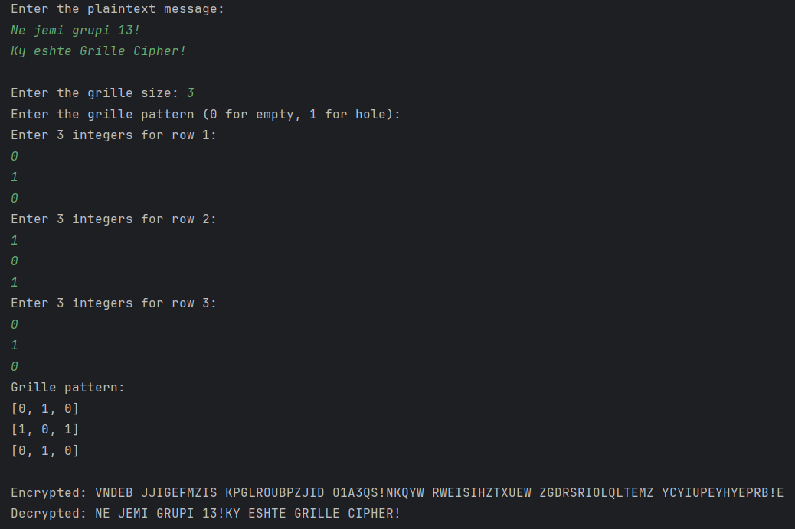

# Siguria e të dhënave - Detyra e dytë - Grupi 13

## Grille Cipher
* Përshkrim i shkurtër se çka është grille cipher  
Grille Cipher është një metodë për të koduar mesazhe. Kjo metodë përdor një matricë të vogël të rregulluar, e cila quhet "grille", për të fshehur ose për të zbuluar mesazhin e fshehur.
  * Enkriptimi:  
Merr një fletë të zbrazët dhe një fletë ku disa nga kutizat e saj janë vrima ("grille"), sepse fletat duhet menduar si matrica. Vendos grille-in mbi fletën e zbrazët dhe përmes vrimave të saj shkruaj shkronjë për shkronjë plaintext-in. Nëse grille-i ka më pak vrima se që kemi shkronja në plaintext, atëherë duhet përsëritur ky proces derisa të jetë shkruar i gjithë plaintext-i, duke përdorur pra përsëri grille në pjesë tjera të fletës se zbrazët. Pas vendosjes së të gjitha shkronjave të plaintext, heqim grille dhe mbushim kutizat qe skanë qenë vrima me shkronja të rëndomta. Kjo na sjellë tek ciphertext-i.
  * Dekriptimi:  
Për të dekriptuar nje mesazh na duhet grille-i identik i njëjtë si kur është enkriptuar mesazhi. Pra ne pranojmë një mesazh me shkronja të rëndomta, dhe mbi të vendosim grille-in. Përmes vrimave të grille-it, kuptojmë shkronjat e plaintext-it. Njësoj si tek enkriptimi nëse kemi grille-in me madhësi më të vogël atëherë lëvizim atë edhe mbi pjesën e mbetur të ciphertext-it.

* Përshkrim i kodit të përdorur për algoritmin  
Për të koduar këtë cipher kemi përdorur gjuhën programuese Python. Kodi ynë përbëhet nga disa funksione të shpjeguara më poshtë:
  * Funskioni input_plaintext() - shërben për të marrë plaintextin nga përdoruesi. Kjo funksionon edhe nëse përdoruesi jep plaintextin me spaces apo newlines.
  * Funksioni input_grille_size() - shërben për të marrë madhësinë e grille nga përdoruesi, saktësisht madhësinë e matricës(nëse përdoruesi jep numrin 3, atëherë matrica do të jetë 3x3). Kemi kushtëzome që të jetë numër pozitiv. (Grille e printojmë për të pasur më të qartë se si duket)
  * Funksioni input_grille() - shërben për të marrë nga përdoruesi patternin e grille. Pra për të caktuar se ku janë vrimat në grille. Kjo bëhet duke kërkuar vlera 1(ka vrimë) dhe 0(ska vrimë) nga përdoruesi. Kemi kushtëzime që të jenë vetëm këto dy vlera. Pra kërkojmë nga përdoruesi që të mbush matricën e madhësisë që ka cekur më parë, me 0 dhe 1.
  * Funksioni encrypt() - merr si parametër plaintext dhe grille, dhe kthen si return ciphertext-in. Plaintext e shndërrojmë në një varg me karaktere, dhe ruajmë një plaintext-index që është i inicializuar me 0, me të cilin gjurmojmë se a kemi ende shkronja të plaintext. Përderisa kemi ende shkronja në plaintext, ecim në çdo kutizë të grille dhe kryejmë hapat e rradhës. Këta hapa janë që nëse kemi në atë kutizë vlerën 1 në grille dhe kemi ende shkronja të plaintext pa u shkruajtur në cipertext, shkruajmë atë shkronjë të plaintext në ciphertext. Nëse skemi më shkronja të plaintext, kutizën që ka pasur vlerën 1 tek grille, e shtojmë një hapësirë. Kurse në qoftë se në atë kutizë të grille kemi vlerën 0, ciphertext i shtohet një shkronjë e rëndomtë.   
Kështu pra fitojmë ciphertext: nëse kemi vrimë/vlerën 1 shto shkronjën e plaintext (nëse ka), ndërsa nëse skemi vrimë/kemi vlerën 0, shto një shkronjë të rëndomtë
  * Funksioni decrypt() - merr si parametër ciphertext dhe grille, dhe kthen si rezultat plaintext-in. Ciphertext e shndërrojmë në një varg me karaktere, dhe ruajmë një ciphertext-index që është i inicializuar me 0, me të cilin gjurmojmë se a kemi ende shkronja të ciphertext. Përderisa kemi ende shkronja në ciphertext, ecim në çdo kutizë të grille, dhe nëse ka vlerën 1, atë vlerë në atë index në ciphertext, e shtojmë në plaintext. Nëse ka vlerën 0, nuk bëjmë asgjë, vetëm ecim në indexin e rradhës. Kështu fitojmë plaintext-in.
  * Në fund kemi thirrur funksionet dhe kemi printuar tekstin e enkriptuar dhe të dekriptuar.

* Udhëzime për përdoruesin
  * Kërkohet plaintext - mund të jepni çfarëdo teksti (me spaces dhe enter), kur përfundoni plaintextin e juaj duheni të bëni enter dy herë rradhazi në mënyrë që të vazhdoni tek hapat e rradhës.
  * Kërkohet grille size - duhet të jepni vetëm një numër pozitiv (psh 4), kjo do të caktojë madhësinë e matricës së përdorur (psh 4x4).
  * Kërkohet grille pattern - këtu do të jepni vetëm vlerat 0(nuk është vrimë) ose 1(është vrimë). Do të ju kërkohet të jepni vlerat veç e veç për secilin rresht. Gjihashtu edhe vlerat e marra për rresht duhet një vlerë, pastaj enter, pastaj të vazhdoni me të tjerat. Mund të shihni një shembull vizuel më poshtë.

* Një shembull i ekzekutimit

## Beale Cipher
Përshkrim i shkurtër se çka është Beale cipher
Beale Cipher është një metodë për të koduar mesazhe. Kjo metodë përdor një apo një grup libërash për të fshehur ose për të zbuluar mesazhin e fshehur.
Enkriptimi:
Zgjidhni një libër ose një grup libërash si çelës.
Caktoni një numër unik për çdo fjalë në libër që zakonisht bazohet në pozicionin e tyre në libër.
Për të koduar një mesazh, zëvendësoni çdo fjalë në mesazh me numrin e saj korrespondente në libër.
Dekriptimi:
Keni qasje në të njëjtin libër ose grup libërash që janë përdorur për enkriptim.
Kërkoni çdo numër në mesazhin e koduar në librat për të gjetur fjalën korrespondente.
Rikrijoni mesazhin origjinal duke zëvendësuar çdo numër me fjalën e tij korrespondente.
Përshkrim i kodit të përdorur për algoritmin:
Për të koduar këtë cipher kemi përdorur gjuhën programuese Java.
Metoda main(String[] args): Kjo është metoda kryesore e programit. Ajo mundeson qe  përdoruesi të mund të zgjedhë midis hyrjes së çelësit manualisht ose ofrimit të një file si çelës. Pastaj kërkon tekstin që do të enkriptohet, e enkripton atë dhe në fund kërkon tekstin që do të dekriptohet, e dekripton atë dhe printon rezultatet.
Metoda encrypt(String plainText, String keyText): Kjo metodë merr plaintextin dhe tekstin e çelësit si hyrje dhe kthen tekstin e enkriptuar. Ajo gjeneron një key map nga teksti i çelësit, ku çdo fjalë në tekstin e çelësit i caktohet një numër unik. Pastaj ajo iteron përmes plaintextit, duke zëvendësuar çdo fjalë me numrin e saj korrespondente nga key mapi.
Metoda decrypt(String cipherText, String keyText): Kjo metodë merr tekstin e enkriptuar dhe tekstin e çelësit si hyrje dhe kthen tekstin e dekriptuar. Ngjashëm me enkriptimin, ajo gjeneron një key map nga teksti i çelësit. Pastaj e ndan tekstin e koduar në numra të veçantë, kërkon çdo numër në key map për të gjetur fjalën korrespondente dhe rikrijon tekstin origjinal.
Metoda generateKeyMap(String keyText): Kjo metodë gjeneron një key map nga teksti i çelësit. Ajo ndan tekstin e çelësit në fjalë të veçanta, i cakton çdo fjale një numër unik dhe ruan hapat në një strukturë të të dhënave hartë.
Metoda readFromFile(String filePath): Kjo metodë lexon përmbajtjen e një file të specifikuar nga file pathi dhe e kthen atë në string. Përdoret kur përdoruesi zgjedh të japë një file si çelës.
Udhëzime për përdoruesin:
Zgjidhni një Opsion: Ju do të nxitni të zgjidhni mes dy opsioneve:
Dhënia manuale e çelësit: Nëse zgjidhni këtë opsion, do të jepni drejtpërdrejt tekstin që do të përdoret per enkriptim të mesazhit tuaj.
Sigurimi i një file si çelës: Nëse zgjidhni këtë opsion, do të siguroni filepath-in për një file që do të përdoret si çelës.
Dhënia e çelësit:  Në varësi të zgjedhjes suaj në hapin e parë: 
Nëse zgjodhët të jepni çelësin manualisht, do t'ju kërkohet të jepni tekstin qe do të paraqet çelësin.
Nëse zgjodhët të siguroni një file si çelës, do t'ju kërkohet të jepni filepath-in e filet që paraqet çelësin.
Jepni tekstin për të enkriptuar:
Pas dhënies së çelësit, do t'ju kërkohet të jepni tekstin që dëshironi ta enkriptoni.
Enkriptimi: Pastaj programi do të enkriptojë tekstin e dhënë duke përdorur çelësin e siguruar.
Jepni tekstin për të dekriptuar:
Pas enkriptimit, do t'ju kërkohet të jepni tekstin që dëshironi të dekriptoni.
Dekriptimi: Programi do të dekriptojë tekstin e dhënë duke përdorur të njëjtin çelës të përdorur për enkriptim.

